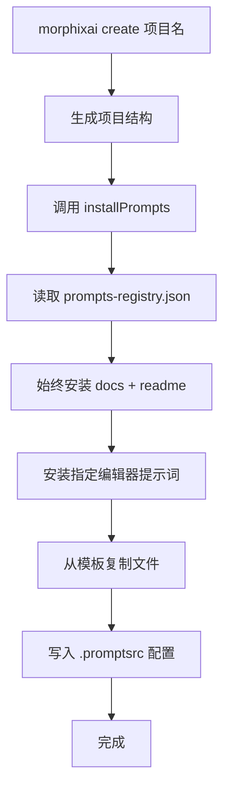
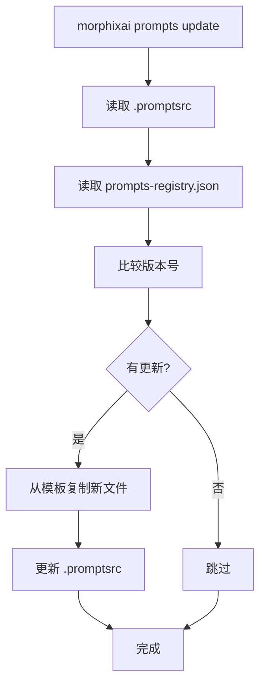
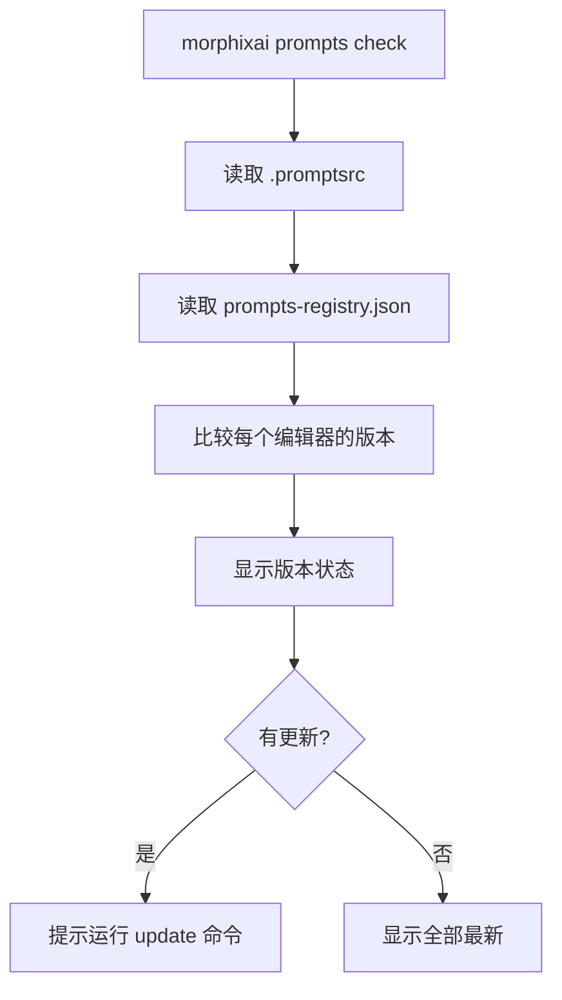

# MorphixAI CLI 提示词管理完整指南

## 📋 目录

1. [功能概述](#功能概述)
2. [提示词类型](#提示词类型)
3. [CLI 命令](#cli-命令)
4. [配置文件](#配置文件)
5. [工作原理](#工作原理)
6. [使用场景](#使用场景)

## 功能概述

MorphixAI CLI 提供了完整的提示词管理功能，用于在项目中安装、更新和管理 AI 编辑器的开发规范文件。

### 核心特点

✅ **本地化**：所有提示词从本地模板复制，无需网络  
✅ **版本管理**：自动检测和更新提示词版本  
✅ **多编辑器支持**：Cursor、Claude Code、README、完整文档  
✅ **自动安装**：创建项目时自动安装所有提示词  
✅ **增量更新**：只更新有变化的提示词  

## 提示词类型

MorphixAI 目前支持 4 种类型的提示词（v2.0.0）：

### 1. Cursor 提示词

```json
{
  "cursor": {
    "version": "2.0.0",
    "description": "Cursor AI prompts for MorphixAI development",
    "files": [".cursorrules"],
    "path": ""
  }
}
```

**文件：** `.cursorrules` (27 行)  
**位置：** 项目根目录  
**作用：** Cursor 编辑器的开发规范  

### 2. Claude 提示词

```json
{
  "claude": {
    "version": "2.0.0",
    "description": "Claude Code prompts for MorphixAI development",
    "files": ["CLAUDE.md"],
    "path": ""
  }
}
```

**文件：** `CLAUDE.md` (51 行)  
**位置：** 项目根目录  
**作用：** Claude Code 编辑器的开发规范  

### 3. README 文档

```json
{
  "readme": {
    "version": "2.0.0",
    "description": "Project README with development guide",
    "files": ["README.md"],
    "path": ""
  }
}
```

**文件：** `README.md` (159 行)  
**位置：** 项目根目录  
**作用：** 项目说明和快速开始指南  

### 4. 完整开发指南

```json
{
  "docs": {
    "version": "2.0.0",
    "description": "Complete development guide (shared by all editors)",
    "files": ["DEVELOPMENT_GUIDE.md"],
    "path": "docs"
  }
}
```

**文件：** `docs/DEVELOPMENT_GUIDE.md` (1330 行)  
**位置：** `docs/` 目录  
**作用：** 完整的开发规范（所有编辑器共享）  

## CLI 命令

### 1. 检查提示词版本

```bash
morphixai prompts check
```

**功能：**
- 检查当前项目中的提示词版本
- 对比本地版本和注册表版本
- 显示哪些提示词需要更新

**输出示例：**
```
✔ Prompts version check completed

📋 Prompts Status (Local):

✅ cursor     v2.0.0 (latest)
✅ claude     v2.0.0 (latest)
✅ readme     v2.0.0 (latest)
✅ docs       v2.0.0 (latest)
```

或者如果有更新：
```
⚠️  cursor     v1.0.0 → v2.0.0 available
⚠️  claude     v1.0.0 → v2.0.0 available

💡 Run morphixai prompts update to update
```

### 2. 更新提示词

```bash
morphixai prompts update
```

**功能：**
- 更新所有过期的提示词
- 从本地模板复制最新版本
- 自动更新 `.promptsrc` 配置

**输出示例：**
```
✔ Prompts updated successfully

🔄 Updated prompts:

   ✅ cursor
   ✅ claude
   ✅ readme
   ✅ docs
```

如果已是最新：
```
✔ All prompts are already up to date

💡 No updates needed
```

### 3. 安装提示词

```bash
# 安装所有提示词（默认）
morphixai prompts install

# 安装特定编辑器的提示词
morphixai prompts install --editor=cursor
morphixai prompts install --editor=claude
```

**功能：**
- 安装指定编辑器的提示词
- 始终安装 `readme` 和 `docs`（核心文件）
- 创建项目时自动执行

**输出示例：**
```
✔ all prompts installed successfully

📦 Installed prompts:

   ✅ docs
   ✅ readme
   ✅ cursor
   ✅ claude
```

## 配置文件

### `.promptsrc`

项目的提示词配置文件，位于项目根目录。

**位置：** `项目根目录/.promptsrc`

**内容示例：**
```json
{
  "version": "2.0.0",
  "source": "local",
  "lastUpdated": "2025-01-01T00:00:00Z",
  "editors": {
    "cursor": {
      "enabled": true,
      "version": "2.0.0",
      "path": ""
    },
    "claude": {
      "enabled": true,
      "version": "2.0.0",
      "path": ""
    },
    "readme": {
      "enabled": true,
      "version": "2.0.0",
      "path": ""
    },
    "docs": {
      "enabled": true,
      "version": "2.0.0",
      "path": "docs"
    }
  }
}
```

**字段说明：**

| 字段 | 类型 | 说明 |
|-----|------|------|
| `version` | string | 配置文件版本 |
| `source` | string | 提示词来源（`local` 表示本地） |
| `lastUpdated` | string | 最后更新时间 |
| `editors` | object | 编辑器配置列表 |
| `editors.*.enabled` | boolean | 是否启用该编辑器 |
| `editors.*.version` | string | 已安装的版本 |
| `editors.*.path` | string | 提示词文件路径 |

### `prompts-registry.json`

提示词注册表，位于 CLI 包内。

**位置：** `packages/cli/prompts-registry.json`

**作用：**
- 定义所有可用的提示词
- 指定每个提示词的版本、文件和路径
- 作为版本检查的参考

## 工作原理

### 安装流程



### 更新流程



### 版本检查流程



## 使用场景

### 场景 1：创建新项目

```bash
# 创建项目时自动安装所有提示词
morphixai create my-app

# 等同于：
# morphixai create my-app
# cd my-app
# morphixai prompts install
```

**结果：**
- 自动创建 `.promptsrc`
- 安装 `.cursorrules`
- 安装 `CLAUDE.md`
- 安装 `README.md`
- 安装 `docs/DEVELOPMENT_GUIDE.md`

### 场景 2：检查更新

```bash
cd my-app
morphixai prompts check
```

**适用情况：**
- 想知道提示词是否有新版本
- 定期检查是否需要更新
- CI/CD 流程中的版本检查

### 场景 3：更新提示词

```bash
cd my-app
morphixai prompts update
```

**适用情况：**
- CLI 包更新后
- 提示词规范有变化
- 需要最新的开发规范

### 场景 4：只安装特定编辑器

```bash
cd my-app

# 只使用 Cursor
morphixai prompts install --editor=cursor

# 只使用 Claude
morphixai prompts install --editor=claude
```

**注意：** `docs` 和 `readme` 始终会被安装（核心文件）

## 核心代码模块

### 1. `prompts.js` - 命令入口

**位置：** `packages/cli/src/commands/prompts.js`

**功能：**
- 提供 `check`、`update`、`install` 三个子命令
- 处理命令行参数
- 调用对应的功能模块

### 2. `installer.js` - 安装逻辑

**位置：** `packages/cli/src/prompts/installer.js`

**核心函数：**

```javascript
// 安装提示词
export async function installPrompts(projectPath, options = {})

// 更新提示词
export async function updatePrompts(projectPath, options = {})
```

**安装规则：**
- 始终安装 `docs` 和 `readme`（核心文件）
- 根据 `--editor` 参数安装指定编辑器
- 默认安装所有编辑器（`cursor` + `claude`）

### 3. `fetcher.js` - 版本管理

**位置：** `packages/cli/src/prompts/fetcher.js`

**核心函数：**

```javascript
// 读取本地注册表
export async function fetchPromptsRegistry()

// 读取项目配置
export async function readLocalPromptsConfig(projectPath)

// 写入项目配置
export async function writeLocalPromptsConfig(projectPath, config)

// 检查版本
export async function checkPromptsVersion(projectPath)
```

## 文件路径映射

### 模板路径

```
packages/templates/react-ionic/template/
├── .cursorrules                # cursor 提示词
├── CLAUDE.md                   # claude 提示词
├── README.md                   # readme 文档
└── docs/
    └── DEVELOPMENT_GUIDE.md    # 完整指南
```

### 项目路径

```
my-app/
├── .cursorrules                # 从模板复制
├── CLAUDE.md                   # 从模板复制
├── README.md                   # 从模板复制
├── .promptsrc                  # 自动生成
└── docs/
    └── DEVELOPMENT_GUIDE.md    # 从模板复制
```

## 最佳实践

### 1. 定期检查更新

```bash
# 在项目中定期运行
morphixai prompts check
```

### 2. CLI 更新后同步提示词

```bash
# 更新 CLI
npm update -g @morphixai/cli

# 进入项目
cd my-app

# 更新提示词
morphixai prompts update
```

### 3. 版本控制

**建议提交的文件：**
- ✅ `.cursorrules`
- ✅ `CLAUDE.md`
- ✅ `README.md`
- ✅ `docs/DEVELOPMENT_GUIDE.md`
- ✅ `.promptsrc`

这些文件应该提交到版本控制，以确保团队使用相同的开发规范。

### 4. CI/CD 集成

```yaml
# .github/workflows/check-prompts.yml
name: Check Prompts Version

on: [push, pull_request]

jobs:
  check:
    runs-on: ubuntu-latest
    steps:
      - uses: actions/checkout@v2
      - uses: actions/setup-node@v2
      - run: npm install -g @morphixai/cli
      - run: morphixai prompts check
```

## 常见问题

### Q1: 提示词文件可以手动修改吗？

**A:** 不建议。手动修改会在下次 `update` 时被覆盖。如果需要自定义，应该：
1. 修改模板文件
2. 或者在项目中保持自定义版本（不更新）

### Q2: 如何跳过特定提示词的更新？

**A:** 目前不支持跳过。所有提示词会一起更新。如果需要保持特定版本，可以：
1. 不运行 `update` 命令
2. 手动恢复被覆盖的文件

### Q3: 提示词版本号如何管理？

**A:** 版本号在 `prompts-registry.json` 中统一管理，遵循语义化版本规范：
- `2.0.0` - 主版本号.次版本号.修订号
- 主版本变化表示不兼容的更改
- 次版本变化表示新功能
- 修订号变化表示 bug 修复

### Q4: 为什么 `docs` 和 `readme` 始终被安装？

**A:** 它们是核心文档，包含：
- 完整的开发规范（所有编辑器共享）
- 项目说明和快速开始指南
- 对所有开发者都是必需的

### Q5: 提示词文件在哪里？

**A:** 所有提示词文件都在本地模板中：
```
packages/templates/react-ionic/template/
```

不再从远程服务器获取，确保稳定可靠。

## 总结

MorphixAI CLI 的提示词管理系统提供了：

✅ **3 个命令**：`check`、`update`、`install`  
✅ **4 种提示词**：cursor、claude、readme、docs  
✅ **自动化流程**：创建时安装、检查更新、增量更新  
✅ **版本管理**：语义化版本、配置文件、注册表  
✅ **本地化**：无需网络、稳定可靠  

通过这套系统，可以确保所有项目使用最新的开发规范和最佳实践！🎉

