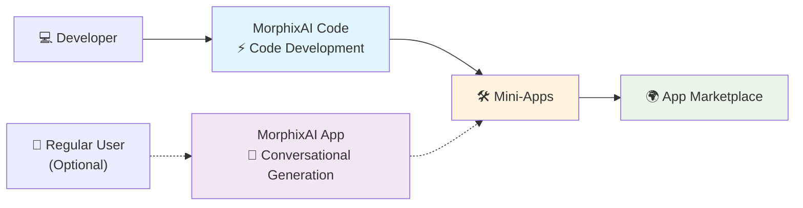

# MorphixAI Code — Rapid, Ready-to-Use Mini‑Apps Framework

> 🇺🇸 English | [🇨🇳 中文](./docs/README_CN.md) | [🇯🇵 日本語](./docs/README_JA.md) | [🇰🇷 한국어](./docs/README_KO.md)

> **Build and ship ready-to-use mini‑apps fast**

### 📲 Where to Experience MorphixAI?
- **iOS**: Search "MorphixAI" in the App Store
- **Android**: Download from the [official website](https://baibian.app/)
- **Web**: Browse the [App Marketplace](https://app-shell.focusbe.com/app-market)

## 📚 Table of Contents
- [Quick Start](#-quick-start)
- [Troubleshooting](#-troubleshooting)
- [Project Structure](#-project-structure)
- [What is MorphixAI?](#-what-is-morphixai)
- [What is MorphixAI Code?](#-what-is-morphixai-code)
- [Development Flow](#-development-flow)
- [Mini-App Development Features](#-mini-app-development-features)
- [What Can Mini-Apps Do?](#-what-can-mini-apps-do)
- [AI Smart Development Examples](#-ai-smart-development-examples)
- [Publish & Share](#-publish--share)
- [Pricing](#-pricing)
- [Get Help](#-get-help)
- [More Resources](#-more-resources)
- [Contributing](#-contributing)
- [License](#-license)
 - [Glossary](#-glossary)

## 🚀 Quick Start

> 🎯 Designed for zero-experience users — just follow the steps to succeed!

### Step 1: Environment Requirements
- **Node.js**: Use LTS versions (18 or 20 recommended). Check with:
  ```bash
  node --version
  ```
- **Supported OS**: macOS, Windows, Linux

If Node.js is missing, download from the [official site](https://nodejs.org/).

### Step 2: Create a New Project

**Option 1: Use npx (Recommended - No installation needed)**
```bash
npx @morphixai/code create my-app
cd my-app
```

**Option 2: Install globally first**
```bash
npm install -g @morphixai/code
morphixai create my-app
cd my-app
```

### Step 3: Install Dependencies
```bash
npm install
```

### Step 4: Start Development
```bash
npm run dev
```

The development console will open at `http://localhost:8812`. Start coding in the `src/` directory!

**💡 Tip**: For the best AI-assisted development experience, use [Cursor](https://cursor.sh) editor.

## 🧰 Troubleshooting
- **Port already in use (8812)**: Use a different port with `morphixai dev --port 3000`
- **Install failures (network/permissions)**: Clear cache with `npm cache clean --force`, then retry. Try `sudo npm install -g @morphixai/code` if you get permission errors.
- **Command not found**: Ensure global npm packages directory is in your PATH, or use `npx @morphixai/code create my-app`
- **Browser didn't open**: Manually visit `http://localhost:8812` (or your custom port)

## 🗂 Project Structure
```
my-app/
├── src/                    # Your mini-app source code
│   ├── app.jsx            # App entry point
│   ├── components/        # React components
│   └── styles/            # CSS modules
├── docs/                  # Documentation (CLAUDE.md, DEVELOPER.md)
├── public/                # Static assets
├── package.json           # Dependencies and scripts
└── project-config.json    # Project configuration and ID
```

### Available Commands
```bash
npm run dev              # Start development server with live reload
npm run build            # Build for production
npm run prompts:check    # Check AI prompts version
npm run prompts:update   # Update AI prompts to latest
```

## 🤖 What is MorphixAI?

**MorphixAI** combines AI Q&A with user-generated mini-apps. You can:
- **Direct Use**: Use practical mini-apps shared by others
- **Create Your Own**: Generate mini-apps via AI conversation or code
- **Share with the World**: Publish to the official app marketplace

## 💡 What is MorphixAI Code?

An open-source development framework offering environment, specifications, and toolchain to quickly build mini-apps that conform to MorphixAI standards.

## ⚡ Development Flow



## 🚀 Ultra-Fast Development Experience
- **Primary Method**: Build with MorphixAI Code and AI assistants
- **Professional Output**: Full-featured mini-apps
- **Easy Sharing**: One-click publishing to the marketplace
- **Alternative**: Conversational generation in the MorphixAI App

## 🎯 Mini-App Development Features
- **Lightning Development**: AI-powered speed from idea to product
- **Zero Barrier**: Frontend beginners can ship professional apps
- **Ready to Use**: No app-store approval needed in MorphixAI
- **AI Smart Assistant**: Describe features, get complete code
- **Cross-Platform**: Web, iOS, and Android

## 🛠️ What Can Mini-Apps Do?

### 📱 System Capabilities
- Data Storage
- Camera & Photos
- File Operations
- Location Services
- Calendar Integration
- Notifications

### 🤖 AI Capabilities
- Intelligent Q&A (GPT, Claude, etc.)
- Image Recognition
- Multimodal Interaction (text/image/voice)
- Network Requests

### 🌟 Application Scenarios
- Personal Productivity, Life Assistants, Creative Tools, Business Apps

## 🤖 AI Smart Development Examples

Describe requirements in natural language to develop apps.

#### Example 1: Create a Component
```
You: Create a user profile card with avatar, name, bio, and follow button.

AI: I'll create it:
1) Create src/app/components/UserProfile.jsx
2) Create src/app/styles/UserProfile.module.css
3) Use modern UI and MorphixAI specs
4) Add responsive design and animations
```

#### Example 2: Add Functionality
```
You: Add like functionality and persist to local storage.

AI: I'll add it:
1) Manage like state with useState
2) Integrate StorageAPI for persistence
3) Add like animation
4) Handle errors
```

### Auto-Generated Code Benefits
✅ Professional quality • ✅ Mobile optimization • ✅ Error handling • ✅ Performance best practices • ✅ Security checks

## 🌍 Publish & Share

### Official App Marketplace (Recommended)
1. Ensure your mini-app works properly
2. Email details to `contact@baibian.app`
3. Provide: App ID, brief feature description, usage scenarios
4. After approval, it will appear in the marketplace

### Private Sharing
1. Run locally on your computer
2. Zip and share the code folder
3. Friends follow the same steps to run

### Marketplace Advantages
- Global users can discover and use your mini-apps
- No installation required inside MorphixAI
- Cross-platform by default

## 💰 Pricing

### Free
- Basic AI models
- Use self-developed or shared mini-apps
- Browse and use marketplace apps

### Paid
- Advanced AI models (e.g., Claude, GPT-4) billed by usage
- Transparent pricing aligned with OpenRouter
- Pay only for the AI you use

## 🔧 Get Help
- Developer Docs: [DEVELOPER.md](./DEVELOPER.md)
- Official Spec: [MorphixAI Development Specification](https://app-shell.focusbe.com/docs/app-development-specification.md)
- Community: GitHub Issues
- AI Assistant: Ask directly in your editor
- Email: `contact@baibian.app`

## 📖 More Resources
- Developer Documentation — [DEVELOPER.md](./DEVELOPER.md)
- Complete Development Specification — [CLAUDE.md](./CLAUDE.md)
- Project Technical Documentation — [docs/technical/project-overview.md](./docs/technical/project-overview.md)
- Development Guidelines — [docs/requirements/development-guidelines.md](./docs/requirements/development-guidelines.md)

## 🗺️ Roadmap
- [ ] Support fullscreen mode
- [ ] Prefer iOS‑style modal onboarding
- [ ] Built‑in capabilities + professional attributes panel
- [ ] Flutter development support
- [ ] GitHub Actions support

## 📦 Publishing (Maintainers)

This project uses [Changesets](https://github.com/changesets/changesets) for version management and publishing.

### Creating a Changeset

When you make changes, create a changeset to describe them:

```bash
pnpm changeset
```

### Publishing Process

1. **Version packages** (creates version bump commits):
   ```bash
   pnpm version-packages
   ```

2. **Publish to npm**:
   ```bash
   pnpm release
   ```

### Automated Publishing

Publishing is automated via GitHub Actions:
1. Merge PR to `main` branch
2. GitHub Actions will create a "Version Packages" PR
3. Merge the version PR to trigger automatic publishing to npm

**Requirements**: Add `NPM_TOKEN` secret in GitHub repository settings.

## 🤝 Contributing

Contributions are welcome! This project uses a monorepo structure:

```
morphixai-code/
├── packages/
│   ├── cli/              # @morphixai/code package
│   └── templates/        # Project templates
├── examples/             # Example applications (excluded from build)
└── docs/                # Documentation
```

**Note**: Build, test, and lint commands only run on packages in `packages/` directory.

### For Contributors
1. Clone the repository:
   ```bash
   git clone https://github.com/Morphicai/morphixai-code.git
   cd morphixai-code
   ```

2. Install dependencies:
   ```bash
   pnpm install
   ```

3. Make your changes in the appropriate package

4. Test locally:
   ```bash
   cd examples/demo-app
   npm run dev
   ```

5. Create a changeset:
   ```bash
   pnpm changeset
   ```

6. Submit a pull request

For detailed development guidance, see `CONTRIBUTING.md`.

## 📄 License
This project is licensed under the MIT License.

## 📘 Glossary
- **Mini‑App**: A small, self-contained app packaged to run inside MorphixAI.
- **App Shell**: The host container (web/native) that loads and runs mini‑apps.
- **HostClient (Host SDK)**: The bridge API exposed by the host for auth, app CRUD, sharing, etc.
- **Unique ID (unique_id)**: Stable identifier for a project across environments; used to fetch/create remote apps.
- **App ID (id)**: Server-generated identifier for a specific remote app resource.
- **Version**: Semantic version of the remote app’s code/config, e.g., 0.1.0.
- **Build Code**: Optimized runtime bundle stored by server for execution.
- **Read‑Only Mode**: UI state where editing/publishing is disabled (e.g., not owner or not logged in).
- **Preview URL**: Shareable URL to run/preview the remote mini‑app.
- **Project ID**: Local development project identifier used by the dev shell.