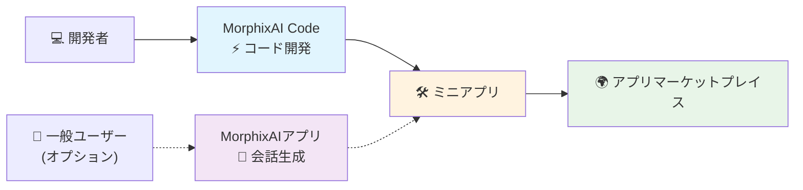

# MorphixAI Code — 迅速に構築できるミニアプリ開発フレームワーク

> 🇺🇸 [English](../README.md) | 🇨🇳 [中文](./README_CN.md) | 🇯🇵 日本語

> **ミニアプリを素早く構築して公開**

### 📲 MorphixAIを体験できる場所
- **iOS**: App Storeで「MorphixAI」を検索
- **Android**: [公式サイト](https://baibian.app/)からダウンロード
- **Web**: [アプリマーケットプレイス](https://app-shell.focusbe.com/app-market)を閲覧

## 📚 目次
- [クイックスタート](#-クイックスタート)
- [トラブルシューティング](#-トラブルシューティング)
- [プロジェクト構造](#-プロジェクト構造)
- [MorphixAIとは？](#-morphixaiとは)
- [MorphixAI Codeとは？](#-morphixai-codeとは)
- [開発フロー](#-開発フロー)
- [ミニアプリ開発の特徴](#-ミニアプリ開発の特徴)
- [ミニアプリでできること](#-ミニアプリでできること)
- [AI支援開発の例](#-ai支援開発の例)
- [公開と共有](#-公開と共有)
- [料金](#-料金)
- [ヘルプ](#-ヘルプ)
- [その他のリソース](#-その他のリソース)
- [コントリビューション](#-コントリビューション)
- [ライセンス](#-ライセンス)
- [用語集](#-用語集)

## 🚀 クイックスタート

> 🎯 経験ゼロのユーザー向けに設計 — ステップに従うだけで成功！

### ステップ1：環境構築
- Node.js: LTSバージョン（18または20を推奨）。確認：
  ```bash
  node --version
  ```
- Git（オプションだが推奨）：
  ```bash
  git --version
  ```
- 対応OS: macOS、Windows、Linux

Node.jsがない場合は[公式サイト](https://nodejs.org/)からダウンロード。Gitは[git-scm.com](https://git-scm.com/)を参照。

### ステップ2：クローン
```bash
git clone https://github.com/Morphicai/morphixai-code.git
cd morphixai-code
```

### ステップ3：依存関係のインストール
```bash
npm install
```

### ステップ4：開発開始
1. エディタでプロジェクトを開く
2. 開発サーバーを起動
   ```bash
   npm run dev
   ```
3. ブラウザが自動的に開きます。開かない場合は `http://localhost:8812` にアクセス
4. `src/app/` でコーディング開始

ヒント：AI支援開発の最高の体験には[Cursor](https://cursor.sh)をお試しください。

## 🧰 トラブルシューティング
- **ポート使用中（8812）**：ポートを使用しているプロセスを終了するか、`vite.config.js`の`server.port`を変更。
- **インストール失敗（ネットワーク/権限）**：キャッシュをクリア`npm cache clean --force`してから`npm install`を再実行。macOS/Linuxでは必要に応じて`sudo npm install`を実行。
- **ブラウザが開かない**：手動で`http://localhost:8812`にアクセス。`vite.config.js`の`server.open`がtrueになっていることを確認。
- **Mermaid図が一部のビューアで表示されない**：GitHubまたはMermaidをサポートするMarkdownツールで表示。

## 🗂 プロジェクト構造
```
src/
  app/                # ミニアプリのソースコード（ここから開始）
  _dev/               # 開発シェル、ユーティリティ、例、設定
public/               # 静的アセット
scripts/              # 開発ヘルパー（watch、restore、ID生成）
vite.config.js        # 開発サーバー設定（デフォルトはポート8812）
```

## 🤖 MorphixAIとは？

**MorphixAI**はAI Q&Aとユーザー生成ミニアプリを組み合わせたプラットフォーム。次のことができます：
- **直接利用**：他の人が共有した実用的なミニアプリを使用
- **独自作成**：AI会話またはコードでミニアプリを生成
- **世界と共有**：公式アプリマーケットプレイスに公開

## 💡 MorphixAI Codeとは？

MorphixAI標準に準拠したミニアプリを迅速に構築するための環境、仕様、ツールチェーンを提供するオープンソース開発フレームワーク。

## ⚡ 開発フロー



## 🚀 超高速開発体験
- **主要な方法**：MorphixAI CodeとAIアシスタントで構築
- **プロフェッショナルな出力**：フル機能のミニアプリ
- **簡単な共有**：ワンクリックでマーケットプレイスに公開
- **代替手段**：MorphixAIアプリでの会話生成

## 🎯 ミニアプリ開発の特徴
- **高速開発**：AIを活用してアイデアから製品まで高速化
- **参入障壁ゼロ**：フロントエンド初心者でもプロアプリを出荷可能
- **すぐに使える**：MorphixAI内でアプリストアの承認不要
- **AIスマートアシスタント**：機能を説明すれば完全なコードを取得
- **クロスプラットフォーム**：Web、iOS、Android対応

## 🛠️ ミニアプリでできること

### 📱 システム機能
- データストレージ
- カメラと写真
- ファイル操作
- 位置情報サービス
- カレンダー連携
- 通知

### 🤖 AI機能
- インテリジェントQ&A（GPT、Claudeなど）
- 画像認識
- マルチモーダルインタラクション（テキスト/画像/音声）
- ネットワークリクエスト

### 🌟 アプリケーションシナリオ
- 個人の生産性、生活アシスタント、クリエイティブツール、ビジネスアプリ

## 🤖 AI支援開発の例

自然言語で要件を記述してアプリを開発。

#### 例1：コンポーネントの作成
```
あなた: アバター、名前、自己紹介、フォローボタンを持つユーザープロファイルカードを作成して。

AI: 作成します：
1) src/app/components/UserProfile.jsxを作成
2) src/app/styles/UserProfile.module.cssを作成
3) モダンなUIとMorphixAI仕様を使用
4) レスポンシブデザインとアニメーションを追加
```

#### 例2：機能の追加
```
あなた: いいね機能を追加して、ローカルストレージに保存して。

AI: 追加します：
1) useStateでいいね状態を管理
2) StorageAPIを統合して永続化
3) いいねアニメーションを追加
4) エラー処理
```

### 自動生成コードの利点
✅ プロフェッショナル品質 • ✅ モバイル最適化 • ✅ エラー処理 • ✅ パフォーマンスベストプラクティス • ✅ セキュリティチェック

## 🌍 公開と共有

### 公式アプリマーケットプレイス（推奨）
1. ミニアプリが正常に動作することを確認
2. 詳細を`contact@baibian.app`にメール送信
3. 提供情報：アプリID、簡単な機能説明、使用シナリオ
4. 承認後、マーケットプレイスに表示

### プライベート共有
1. ローカルコンピューターで実行
2. コードフォルダをZipして共有
3. 友人が同じステップで実行

### マーケットプレイスの利点
- 世界中のユーザーがあなたのミニアプリを発見して使用可能
- MorphixAI内でインストール不要
- デフォルトでクロスプラットフォーム

## 💰 料金

### 無料
- 基本AIモデル
- 自己開発または共有されたミニアプリの使用
- マーケットプレイスアプリの閲覧と使用

### 有料
- 高度なAIモデル（Claude、GPT-4など）を使用量に応じて課金
- OpenRouterに準拠した透明な価格設定
- 使用したAIのみに対して支払い

## 🔧 ヘルプ
- 公式仕様：[MorphixAI開発仕様](https://app-shell.focusbe.com/docs/app-development-specification.md)
- コミュニティ：[GitHub Issues](https://github.com/Morphicai/morphixai-code/issues)
- AIアシスタント：エディタで直接質問
- メール：`contact@baibian.app`

## 📖 その他のリソース
- コントリビューションガイド — [CONTRIBUTING.md](../CONTRIBUTING.md)
- クイックスタートガイド — [QUICKSTART_RELEASE.md](../QUICKSTART_RELEASE.md)
- CLIプロンプトガイド — [CLI_PROMPTS_GUIDE.md](../CLI_PROMPTS_GUIDE.md)
- リモートプロンプトガイド — [REMOTE_PROMPTS_GUIDE.md](../REMOTE_PROMPTS_GUIDE.md)

## 🗺️ ロードマップ
- [ ] フルスクリーンモードのサポート
- [ ] iOSスタイルのモーダルポップアップの採用を推奨
- [ ] Flutter開発のサポート
- [ ] GitHub Actionsのサポート
- [ ] 組み込み機能 + プロフェッショナル属性表示パネル

## 🤝 コントリビューション
コントリビューションを歓迎します！issueやpull requestを開いてください。ローカル開発のガイダンスは`DEVELOPER.md`を参照してください。

## 📄 ライセンス
このプロジェクトはMITライセンスの下でライセンスされています。

## 📘 用語集
- **ミニアプリ**: MorphixAI内で実行されるように パッケージ化された小規模で自己完結型のアプリ。
- **アプリシェル**: ミニアプリをロードして実行するホストコンテナ（Web/ネイティブ）。
- **HostClient（Host SDK）**: 認証、アプリCRUD、共有などのためにホストが公開するブリッジAPI。
- **ユニークID（unique_id）**: 環境全体でプロジェクトの安定した識別子。リモートアプリの取得/作成に使用。
- **アプリID（id）**: 特定のリモートアプリリソースのサーバー生成識別子。
- **バージョン**: リモートアプリのコード/設定のセマンティックバージョン（例：0.1.0）。
- **ビルドコード**: 実行のためにサーバーが保存する最適化されたランタイムバンドル。
- **読み取り専用モード**: 編集/公開が無効になっているUI状態（例：所有者でないか、ログインしていない）。
- **プレビューURL**: リモートミニアプリを実行/プレビューするための共有可能なURL。
- **プロジェクトID**: 開発シェルが使用するローカル開発プロジェクト識別子。
