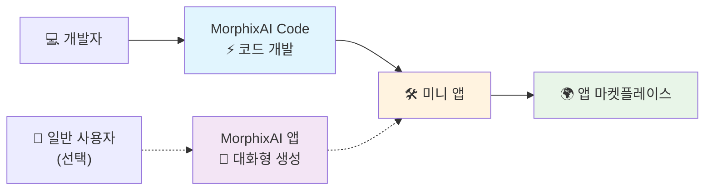

# MorphixAI Code — 빠르고 즉시 사용 가능한 미니 앱 프레임워크

> 🇺🇸 English | [🇨🇳 中文](./README_CN.md) | [🇯🇵 日本語](./README_JA.md) | 🇰🇷 한국어

> **즉시 사용 가능한 미니 앱을 빠르게 구축하고 배포하세요**

### 📲 MorphixAI는 어디서 체험할 수 있나요?
- **iOS**: App Store에서 "MorphixAI" 검색
- **Android**: [공식 웹사이트](https://baibian.app/)에서 다운로드
- **웹**: [앱 마켓플레이스](https://app-shell.focusbe.com/app-market) 방문

## 📚 목차
- [빠른 시작](#-빠른-시작)
- [문제 해결](#-문제-해결)
- [프로젝트 구조](#-프로젝트-구조)
- [MorphixAI란?](#-morphixai란)
- [MorphixAI Code란?](#-morphixai-code란)
- [개발 흐름](#-개발-흐름)
- [초고속 개발 경험](#-초고속-개발-경험)
- [미니 앱 개발 기능](#-미니-앱-개발-기능)
- [미니 앱으로 무엇을 할 수 있나요?](#️-미니-앱으로-무엇을-할-수-있나요)
- [AI 스마트 개발 예제](#-ai-스마트-개발-예제)
- [게시 및 공유](#-게시-및-공유)
- [가격 정책](#-가격-정책)
- [도움 받기](#-도움-받기)
- [추가 리소스](#-추가-리소스)
- [기여하기](#-기여하기)
- [라이선스](#-라이선스)
- [용어 사전](#-용어-사전)

## 🚀 빠른 시작

> 🎯 경험이 전혀 없는 사용자를 위해 설계되었습니다 — 단계별로 따라하면 성공할 수 있습니다!

### 1단계: 환경 설정
- Node.js: LTS 버전 사용 (18 또는 20 권장). 확인 방법:
  ```bash
  node --version
  ```
- Git (선택 사항이지만 권장):
  ```bash
  git --version
  ```
- 지원 OS: macOS, Windows, Linux

Node.js가 없다면 [공식 사이트](https://nodejs.org/)에서 다운로드하세요. Git은 [git-scm.com](https://git-scm.com/)을 참조하세요.

### 2단계: 클론
```bash
git clone https://github.com/Morphicai/morphixai-code.git
cd morphixai-code
```

### 3단계: 의존성 설치
```bash
npm install
```

### 4단계: 개발 시작
1. 에디터로 프로젝트 열기
2. 개발 서버 시작
   ```bash
   npm run dev
   ```
3. 브라우저가 자동으로 열립니다. 열리지 않으면 `http://localhost:8812` 방문
4. `src/app/`에서 코딩 시작

팁: 최고의 AI 지원 개발 경험을 위해 [Cursor](https://cursor.sh)를 사용해보세요.

## 🧰 문제 해결
- **포트 사용 중 (8812)**: 포트를 사용하는 프로세스를 종료하거나 `vite.config.js`에서 `server.port`를 변경하세요.
- **설치 실패 (네트워크/권한)**: 캐시 정리 `npm cache clean --force` 후 `npm install` 재시도. macOS/Linux에서는 필요한 경우에만 `sudo npm install` 시도하세요.
- **브라우저가 열리지 않음**: `http://localhost:8812`에 수동으로 접속하고, `vite.config.js`의 `server.open`이 true인지 확인하세요.
- **일부 뷰어에서 Mermaid 다이어그램이 렌더링되지 않음**: GitHub 또는 Mermaid를 지원하는 마크다운 도구에서 확인하세요.

## 🗂 프로젝트 구조
```
src/
  app/                # 미니 앱 소스 코드 (여기서 시작)
  _dev/               # 개발 셸, 유틸리티, 예제, 설정
public/               # 정적 자산
scripts/              # 개발 도우미 (watch, restore, id 생성)
vite.config.js        # 개발 서버 설정 (기본 포트 8812)
```

## 🤖 MorphixAI란?

**MorphixAI**는 AI 질의응답과 사용자 제작 미니 앱을 결합한 플랫폼입니다. 다음이 가능합니다:
- **즉시 사용**: 다른 사용자가 공유한 실용적인 미니 앱 사용
- **직접 제작**: AI 대화나 코드를 통해 미니 앱 생성
- **전 세계와 공유**: 공식 앱 마켓플레이스에 게시

## 💡 MorphixAI Code란?

MorphixAI 표준을 준수하는 미니 앱을 빠르게 구축할 수 있는 환경, 사양 및 툴체인을 제공하는 오픈소스 개발 프레임워크입니다.

## ⚡ 개발 흐름



## 🚀 초고속 개발 경험
- **주요 방법**: MorphixAI Code와 AI 어시스턴트로 구축
- **전문적 결과물**: 완전한 기능을 갖춘 미니 앱
- **간편한 공유**: 원클릭으로 마켓플레이스에 게시
- **대안**: MorphixAI 앱에서 대화형 생성

## 🎯 미니 앱 개발 기능
- **초고속 개발**: AI 기반으로 아이디어에서 제품까지 빠르게
- **진입 장벽 제로**: 프론트엔드 초보자도 전문 앱 배포 가능
- **즉시 사용**: MorphixAI에서 앱스토어 승인 불필요
- **AI 스마트 어시스턴트**: 기능 설명하면 완전한 코드 생성
- **크로스 플랫폼**: 웹, iOS, Android

## 🛠️ 미니 앱으로 무엇을 할 수 있나요?

### 📱 시스템 기능
- 데이터 저장
- 카메라 및 사진
- 파일 작업
- 위치 서비스
- 캘린더 통합
- 알림

### 🤖 AI 기능
- 지능형 질의응답 (GPT, Claude 등)
- 이미지 인식
- 멀티모달 상호작용 (텍스트/이미지/음성)
- 네트워크 요청

### 🌟 응용 시나리오
- 개인 생산성, 생활 도우미, 창작 도구, 비즈니스 앱

## 🤖 AI 스마트 개발 예제

자연어로 요구사항을 설명하여 앱을 개발할 수 있습니다.

#### 예제 1: 컴포넌트 생성
```
사용자: 아바타, 이름, 소개, 팔로우 버튼이 있는 사용자 프로필 카드를 만들어주세요.

AI: 생성하겠습니다:
1) src/app/components/UserProfile.jsx 생성
2) src/app/styles/UserProfile.module.css 생성
3) 현대적인 UI와 MorphixAI 사양 사용
4) 반응형 디자인과 애니메이션 추가
```

#### 예제 2: 기능 추가
```
사용자: 좋아요 기능을 추가하고 로컬 스토리지에 저장해주세요.

AI: 추가하겠습니다:
1) useState로 좋아요 상태 관리
2) 영구 저장을 위해 StorageAPI 통합
3) 좋아요 애니메이션 추가
4) 오류 처리
```

### 자동 생성 코드의 장점
✅ 전문가 수준 품질 • ✅ 모바일 최적화 • ✅ 오류 처리 • ✅ 성능 모범 사례 • ✅ 보안 검사

## 🌍 게시 및 공유

### 공식 앱 마켓플레이스 (권장)
1. 미니 앱이 제대로 작동하는지 확인
2. `contact@baibian.app`로 세부 정보 이메일 발송
3. 제공 사항: 앱 ID, 간단한 기능 설명, 사용 시나리오
4. 승인 후 마켓플레이스에 표시

### 비공개 공유
1. 컴퓨터에서 로컬로 실행
2. 코드 폴더를 압축하여 공유
3. 친구가 동일한 단계를 따라 실행

### 마켓플레이스의 장점
- 전 세계 사용자가 미니 앱을 발견하고 사용 가능
- MorphixAI 내에서 설치 불필요
- 기본적으로 크로스 플랫폼

## 💰 가격 정책

### 무료
- 기본 AI 모델
- 자체 개발 또는 공유 미니 앱 사용
- 마켓플레이스 앱 검색 및 사용

### 유료
- 고급 AI 모델 (예: Claude, GPT-4) 사용량 기반 과금
- OpenRouter와 동일한 투명한 가격 정책
- 사용한 AI에 대해서만 지불

## 🔧 도움 받기
- 개발자 문서: [DEVELOPER.md](../DEVELOPER.md)
- 공식 사양: [MorphixAI 개발 사양](https://app-shell.focusbe.com/docs/app-development-specification.md)
- 커뮤니티: GitHub Issues
- AI 어시스턴트: 에디터에서 직접 질문
- 이메일: `contact@baibian.app`

## 📖 추가 리소스
- 개발자 문서 — [DEVELOPER.md](../DEVELOPER.md)
- 완전한 개발 사양 — [CLAUDE.md](../CLAUDE.md)
- 프로젝트 기술 문서 — [docs/technical/project-overview.md](./technical/project-overview.md)
- 개발 가이드라인 — [docs/requirements/development-guidelines.md](./requirements/development-guidelines.md)

## 🗺️ 로드맵
- [ ] 전체 화면 모드 지원
- [ ] iOS 스타일 모달 온보딩 우선 적용
- [ ] 내장 기능 + 전문 속성 패널
- [ ] Flutter 개발 지원
- [ ] GitHub Actions 지원

## 🤝 기여하기
기여를 환영합니다! 이슈나 풀 리퀘스트를 열어주세요. 로컬 개발 가이드는 `DEVELOPER.md`를 참조하세요.

## 📄 라이선스
이 프로젝트는 MIT 라이선스에 따라 라이선스가 부여됩니다.

## 📘 용어 사전
- **미니 앱(Mini‑App)**: MorphixAI 내에서 실행되도록 패키징된 작고 독립적인 앱입니다.
- **앱 셸(App Shell)**: 미니 앱을 로드하고 실행하는 호스트 컨테이너(웹/네이티브)입니다.
- **HostClient (Host SDK)**: 인증, 앱 CRUD, 공유 등을 위해 호스트가 노출하는 브리지 API입니다.
- **고유 ID (unique_id)**: 환경 간 프로젝트의 안정적인 식별자로, 원격 앱을 가져오거나 생성하는 데 사용됩니다.
- **앱 ID (id)**: 특정 원격 앱 리소스에 대한 서버 생성 식별자입니다.
- **버전(Version)**: 원격 앱의 코드/설정의 시맨틱 버전(예: 0.1.0)입니다.
- **빌드 코드(Build Code)**: 실행을 위해 서버에 저장된 최적화된 런타임 번들입니다.
- **읽기 전용 모드(Read‑Only Mode)**: 편집/게시가 비활성화된 UI 상태(예: 소유자가 아니거나 로그인하지 않은 경우)입니다.
- **미리보기 URL(Preview URL)**: 원격 미니 앱을 실행/미리보기할 수 있는 공유 가능한 URL입니다.
- **프로젝트 ID(Project ID)**: 개발 셸에서 사용하는 로컬 개발 프로젝트 식별자입니다.


